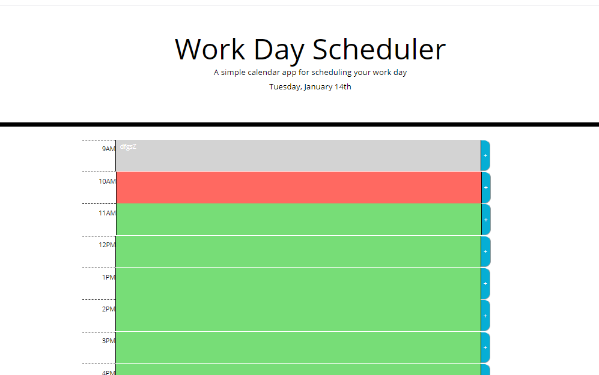

# Day Planner

## General Info 

A basic work day planner for normal business hours 9 am to 5 pm. The time blocks rotate color to indicate the present, past, or future hour. The user can add tasks in the provided text area and save them to their day. 

[Deploy Here](https://natashacwolfe.github.io/day-planner/)

## Tech/framework used
* HTML
* CSS
* Bootstrap
* JavaScript
* JQuery
* moments.js

## Purpose

The day planner project was to apply what I have been learning about JQuery. We were given the CSS with classes already listed, it was fun way to work in reverse to figure out how to write the HTML. It was a fun puzzle to connect the HTML and CSS. 

